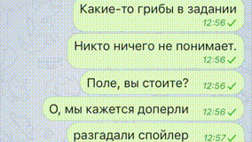
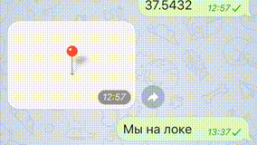

Telegram-бот для игры в [дозор](http://dzzzr.ru). Является прокси-клиентом для старого и неповоротливого движка дозора.
 
Написан на `python3`. Для работы нужна база `postgresql` данных для хранения состояния бота. 

# Функции

* Парсит коды из чатов (групповых или личных), пробивает в движок. Отправляет в ответ собеседнику статус пробития кода.
* Проверяет состояние движка. Если какие-то коды взяты, то посылает табличку кодов в канал.
* Посылает location-сообщение, если видит сообщение с координатами.

# Gif

# Использование

Можно запустить локально на вашем компьютере, либо на сервере. Ниже я опишу процесс настройки бота на mac/linux системах.
В винде может это все сработает, но я не уверен.
  

* Убедитесь, что у вас есть python: `python3 --version`. Если нет - поставьте.
* Убедитесь, что у вас есть база: `psql --version`. Если нет - поставьте. Создайте там пользователя и базу.
* Убедитесь, что у вас есть git: `git --version`. Если нет - поставьте.
* Создайте директорию, в которой будет все, относящееся к проекту. `mkdir drbot`. Перейдите туда: `cd drbot`.
* Склонируйте репозиторий проекта: `git clone ... src`
* Заведите себе python виртуальное окружение: `virtualenv env -p python3`. Активируйте его `source ./env/bin/activate`
* Зайдите в директорию с кодом `cd src`.
* Установите пакеты: `pip install -r ./requirements.txt`
* Создайте файл настроек: `cp ./settings.example.py ./settings.py`. Откройте его каким-нибудь редактором.
* Откройте приложение для telegram, и идите общаться с ботом `@botfather`. 
* Создайте бота, его токен запишите в файле settings.py в переменную `TOKEN`. 
* Создайте канал, его id запишите в файле settings.py в переменную `CHANNEL_ID`.
* Пригласите бота в канал, наделите его админскими полномочиями.
* Напиште что-нибудь боту, подпишитесь сами на канал.
* Запустите бота `python bot.py`. Бот должен начать работать без ошибок.
* Напиште боту `/help`. Он должен ответить списком комманд.

# Структура
Бот написан в рамках паттерна mvc.

## models.py

Модель, источник данных. Основной класс - Parser, который парсит дозорный движок.

## views.py

Вьюхи, способ отоюражения данных 

## bot.py

Контроллер. Обрабатывает действия пользователей, и посылает им сообщения.
